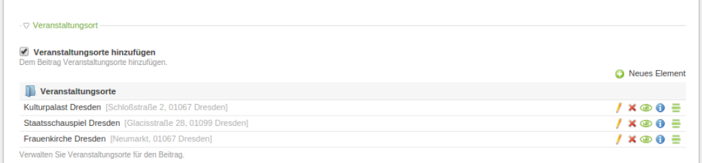
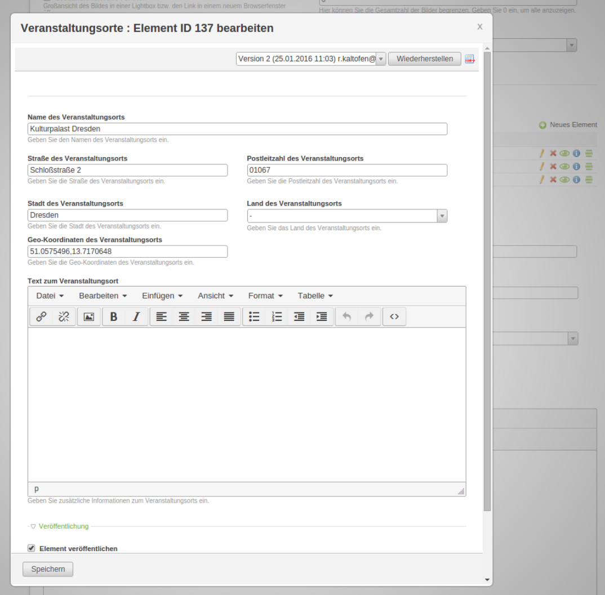

# Contao FieldPalette bundle

[](https://packagist.org/packages/heimrichhannot/contao-fieldpalette-bundle)
[](https://packagist.org/packages/heimrichhannot/contao-fieldpalette-bundle)
[](https://travis-ci.org/heimrichhannot/contao-fieldpalette-bundle)
[](https://coveralls.io/github/heimrichhannot/contao-fieldpalette-bundle?branch=master)

> If you're in search of an multi column input field and the storage of values in another table is an explicit requirement, we recommend to use [Multi Column Editor Bundle] instead, as it has less possible sideeffects and is more often updated due it's higher usage.

> Known Issue: There is a problem with this bundle that may lead to issues with the contao picker input type.

FieldPalette is a contao widget similar to [MultiColumnWizard](https://github.com/menatwork/MultiColumnWizard).
Unlike MultiColumnWizard, fields are stored flatly into `tl_fieldpalette` table and synced with its parent field.

The fieldpalette configuration is based on Contao's [Data Container Arrays](https://docs.contao.org/books/api/dca/index.html).


*FieldPalette Wizard - ListView*


*FieldPalette Wizard - Edit item*


## Technical instructions

### Install 

```
composer require heimrichhannot/contao-fieldpalette-bundle
```

You need to updated the contao database updated. 

### Getting started

FieldPalette comes with an custom input type `fieldpalette`. The configuration for this input type is done in the `fieldpalette` index of the field configuration array. You can customize your fieldpalette nearly as an "normal" dca configuration. When you finished setting up your fieldpalette input, you need to call the contao database tool to add the new fields to the table.  See following example for a real world use case:

#### Default Setup (`tl_fieldpalette` table)


This example shows the setup of an fieldpalette field within tl_news by using it within an subpalette. That (shortend) example is available within the module [Contao News Leisure Bundle](https://github.com/heimrichhannot/contao-news-leisure-bundle).

```php
// src/Resource/contao/dca/tl_news.php (Bundle)
// app/Resource/contao/dca/tl_news.php (Contao 4.4 Projekt)
// contao/dca/tl_news.php (Contao 4.9 Projekt)

$dc = &$GLOBALS['TL_DCA']['tl_news'];

$fields = array
(
	'venues'              => array
	(
		'label'        => &$GLOBALS['TL_LANG']['tl_news']['venues'],
		'inputType'    => 'fieldpalette',
		'foreignKey'   => 'tl_fieldpalette.id',
		'relation'     => array('type' => 'hasMany', 'load' => 'eager'),
		'sql'          => "blob NULL",
		'fieldpalette' => array
		(
			'config' => array(
				'hidePublished' => false
			),
			'list'     => array
			(
				'label' => array
				(
					'fields' => array('venueName', 'venueStreet', 'venuePostal', 'venueCity'),
					'format' => '%s <span style="color:#b3b3b3;padding-left:3px">[%s, %s %s]</span>',
				),
			),
			'palettes' => array
			(
				'default' => 'venueName,venueStreet,venuePostal,venueCity',
			),
			'fields'   => array
			(
				'venueName'         => array
				(
					'label'     => &$GLOBALS['TL_LANG']['tl_news']['venueName'],
					'exclude'   => true,
					'search'    => true,
					'inputType' => 'text',
					'eval'      => array('maxlength' => 255, 'tl_class' => 'long'),
					'sql'       => "varchar(255) NOT NULL default ''",
				),
				'venueStreet'       => array
				(
					'label'     => &$GLOBALS['TL_LANG']['tl_news']['venueStreet'],
					'exclude'   => true,
					'search'    => true,
					'inputType' => 'text',
					'eval'      => array('maxlength' => 255, 'tl_class' => 'w50'),
					'sql'       => "varchar(255) NOT NULL default ''",
				),
				'venuePostal'       => array
				(
					'label'     => &$GLOBALS['TL_LANG']['tl_news']['venuePostal'],
					'exclude'   => true,
					'search'    => true,
					'inputType' => 'text',
					'eval'      => array('maxlength' => 32, 'tl_class' => 'w50'),
					'sql'       => "varchar(32) NOT NULL default ''",
				),
				'venueCity'         => array
				(
					'label'     => &$GLOBALS['TL_LANG']['tl_news']['venueCity'],
					'exclude'   => true,
					'filter'    => true,
					'search'    => true,
					'sorting'   => true,
					'inputType' => 'text',
					'eval'      => array('maxlength' => 255, 'tl_class' => 'w50'),
					'sql'       => "varchar(255) NOT NULL default ''",
				),
			),
		),
	),
);

$dc['fields'] = array_merge($dc['fields'], $fields);
```


## Developers

### Guides

[DCA reference](docs/developers/dca_reference.md)  
[Custom table set up](docs/developers/custom_table.md)  
[Working with fieldpalette records](/docs/developers/fieldpalette_records.md) (copying (parent) records)  

### Working with fieldpalette model

The `FieldPaletteModel` is not intended to be called directly and all custom methods are non static. We recommend to use the `huh.fieldpalette.manager` service. 

Example: 
```php
/** 
 * @var ContainerInterface $container 
 */

// Return a model instance (with default table) for usage with model method (like find methods)
$container->get('huh.fieldpalette.manager')->getInstance()->findByPidAndTableAndField($item->id, 'tl_item', 'parentItem');

// Return a new model instance
$container->get('huh.fieldpalette.manager')->createModel()->findByPidAndTableAndField($item->id, 'tl_item', 'parentItem');

// Return a new model instance with custom table
$container->get('huh.fieldpalette.manager')->createModelByTable('tl_my_custom_table')->findByPidAndTableAndField($item->id, 'tl_item', 'parentItem');
```

Default model methods are still callable static. Custom method can also be called by creating a new model instance. 

### Widgets

Name         | Description
------------ | -----------
fieldpalette | The FieldPaletteWizard renders the tl_fieldpalette items and provide crud functionality within its parent record (e.g. tl_news).

### Fields

tl_fieldpalette:

Name      | Description
--------- | -----------
id        | autoincrement unique identifiere
pid       | id of the parent entry
ptable    | parent table name (e.g. tl_news)
pfield    | parent field name (e.g. tl_news.venues)
sorting   | the sorting value
published | the published state (1 = published) 
start     | timestamp from where the element is published 
stop      | timestamp until the element is published

### Form Callbacks

tl_fieldpalette:

Type              | Description
----------------- | -----------
oncreate_callback | Get fieldpalette key from request, check if the parent table is active within Fieldpalette Registry and set the pfield to tl_fieldpalette item. 
onsubmit_callback | Update/Sync parent fieldpalette item value (for example tl_news.venues) when tl_fieldpalette entries were updated.
oncut_callback    | Update/Sync parent fieldpalette item value (for example tl_news.venues) when tl_fieldpalette entries were sorted.
ondelete_callback | Update/Sync parent fieldpalette item value (for example tl_news.venues) when tl_fieldpalette entries were deleted.


### Hooks

Name               | Arguments                     | Description
-----------------  | ----------------------------- | -----------
loadDataContainer  | $strTable                     | Register fields from parent datacontainer (like tl_news) to tl_fieldpalette and disable fieldpalette support from back end modules where no fieldpalette fields exists (see: initializeSystem Hook). 
initializeSystem   | -                             | Enable tl_fieldpalette table within all back end modules.	
executePostActions | $strAction, DataContainer $dc | Add refreshFieldPaletteField ajax action that return the updated FieldPaletteWizard content.

## Restrictions

* only supports DC_Table DataContainers
